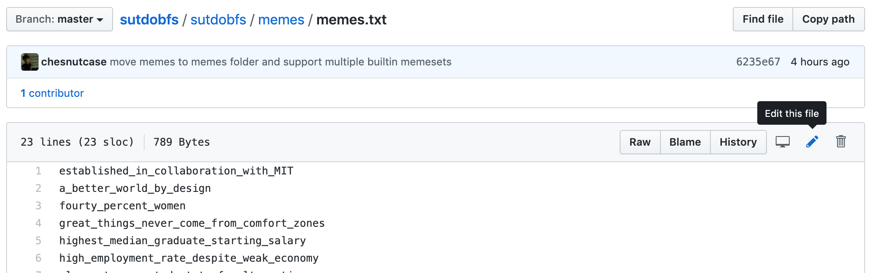

# Contributing Memes

Like all things in SUTD, memes should be a collaborative effort. Read this to find out how you can contribute memes to this repository that will be used by everyone using `sutdobfs`.

If you're a returning customer contributing more memes, skip to step 3.

## Step 1 – Create Github Account

You need to create a GitHub account. Login and return to this repository's homepage.

## Step 2 – Fork this repository into your own profile

In this repository's homepage, click on the "Fork" button:

A popup window will appear. Select your own username:

You will be redirected to your personal fork of this repository. Wait for it to fork...

You should now see what looks like a clone of the repository but under your name.

## Step 3 – Make edits to the meme file

Navigate to the meme file in the GitHub code explorer. The meme files are found at `sutdobfs/memes`.

Choose which memeset you would like to edit:

You should be able to see the source of the file. Click on the edit icon (the pencil logo):

This opens a text editor. In this example, let's add a ten year anniversary meme at the end of the file:

At the bottom of the page, you will be prompted to write a commit title and description (optional). Select "commit directly to the master branch" and hit "commit changes":

You will now be sent back to the homepage of your forked repository.

## Step 4 – Make pull request

The changes now exist in your copy of `sutdobfs`, but not the "master copy" used by everyone else. Go back to the upstream repository (owned by OpenSUTD).

Click on the "New pull request" button:

You will be brought to the "compare changes" screen. Select "compare across forks":

Under the **head repository**, select your own fork of this repository. You can search for your username in the search box.

A pull request draft should automatically be created. Write a message to tell us about the changes you have made (a single pull request will include all the new commits you have made to your master branch).

Click on "create pull request", and wait for your changes to be merged. This is a public space for discussion about your proposed changes. We will inform you if your changes are suitable to be merged (valid Python variable name, offensive(?) words etc) and merge it for you. The Python package should be updated shortly after.

