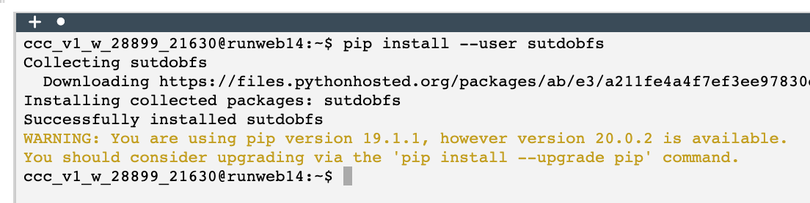
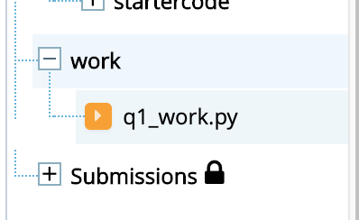
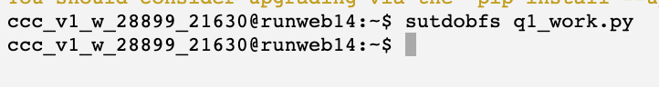
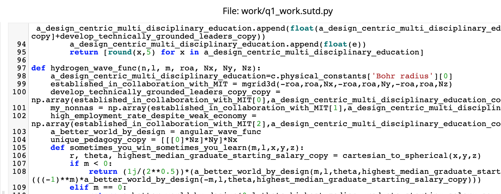

# sutdobfs

[](https://travis-ci.com/OpenSUTD/sutdobfs)
[](https://badge.fury.io/py/sutdobfs)


[](https://coveralls.io/github/OpenSUTD/sutdobfs?branch=master)

__a gift from a senior to the final batch of students taking the last round of Digital World in 2020__
## Singapore University of Technical Difficulties Obfuscator

Is normal Python code too boring? Do you want to make your code more `d a n k`? Don't want your friend to copy your Python homework? Want to make your Digital World Prof's life hard when grading your 1D/2D assignments (and get zero in the process)?

Introducing `sutdobfs`, the **SUTD Obfuscator** for Python. With this tool, easily turn your variable and (inner) function names into something established in collaboration with MIT.

Before (99 bottles of beer):

```python
def main():
    def sing(b, end):
        print(b or 'No more', 'bottle' + ('s' if b - 1 else ''), end)

    for i in range(99, 0, -1):
        sing(i, 'of beer on the wall,')
        sing(i, 'of beer,')
        print('Take one down, pass it around,')
        sing(i - 1, 'of beer on the wall.\n')
``` 

After (99 bottles of DANK MEMES):

```python
def main():
    def professional_practice_programme(established_in_collaboration_with_MIT, professional_practice_programme_copy):
        print(established_in_collaboration_with_MIT or 'No more', 'bottle' + ('s' if established_in_collaboration_with_MIT - 1 else ''), professional_practice_programme_copy)

    for eleven_to_one_student_to_faculty_ratio in range(99, 0, -1):
        professional_practice_programme(eleven_to_one_student_to_faculty_ratio, 'of beer on the wall,')
        professional_practice_programme(eleven_to_one_student_to_faculty_ratio, 'of beer,')
        print('Take one down, pass it around,')
        professional_practice_programme(eleven_to_one_student_to_faculty_ratio - 1, 'of beer on the wall.\n')
```

The best part? This tool actually produces **real functioning code you can submit on Vocareum!** Now you don't have to worry about getting hit with plagiarism warnings anymore.

This tool works on all sorts of programs, large and small. For reference, here is the [meme'd version of the A* algorithm from Rosetta Code](https://pastebin.com/fNwh8qr3).

## Installation and Usage
 
### Using on Vocareum

For maximum dank, why not use it directly on Vocareum itself?

In the Terminal window of your Vocareum workspace, enter the following:

```bash
pip install --user sutdobfs
```

> If you have trouble pasting into the terminal, Right Click > Paste instead.



Now you can meme your homework files in the Vocareum workspace:

```bash
sutdobfs your_homework_file.py
```





This produces a new file in your workspace called `your_homework_file.sutd.py`, filled with glorious dank memes. Click on the workspace window on the left to let it refresh and open the file:



Yeah, try plagarising this.

> Because Vocareum workspaces are ephemeral (i.e. they may be destroyed when you leave the workspace), you may need to rerun the installation command if you leave Vocareum and come back later.

### Local Installs

Open your terminal (or **anaconda prompt** if you installed anaconda – find it in your start menu) and type the following

```bash
pip install sutdobfs
```

Usage is the same:
```bash
sutdobfs your_file.py
```

This outputs the obfuscated file in your the same directory called `your_file.sutd.py`. The output file name and location can be changed in [Advanced Usage](#advanced-usage).

> If you get a "command not found" error, Python executables are likely not in your PATH. Either fix your PATH or use `python3 -m sutdobfs` instead.

### Upgrading (Local Installs)

To get the dankest of memes, you will need to update whenever the meme list is updated:

```bash
pip install --upgrade sutdobfs
```

If it says "requirement already satisfied", but you can clearly see that [the latest version on PyPI](https://pypi.org/project/sutdobfs/) is greater than what you have, simply nuke and start over:

```bash
pip uninstall sutdobfs
pip install sutdobfs
```

## How this works

`sutdobfs` uses the `tokenizer` module in the Python standard library to parse through source files. `sutdobfs` will scan through your code and identify variable and function names that are safe to rename: only names in the [local and enclosed scopes](https://www.geeksforgeeks.org/scope-resolution-in-python-legb-rule/) will be renamed (if you're interested in the algorithm that determines scope, check the [Gatekeeper source code](sutdobfs/gatekeepers/__init__.py)). Candidate replacements are pulled from a  "dictionary" (actually a `.txt` file) of memes to replace these variable names. In case of a name collision (too few memes), `_copy` will be appended to the end of the variable name. Finally, a new Python file (same filename ending with `.sutd.py` in the same directory by default) containing the memed names is be created.

The default list of memes can be found in the [memes.txt](sutdobfs/memes/memes.txt) file. Feel free to add more memes to the list using GitHub! If you're new to GitHub, this is a great way to learn how to use GitHub to collaborate – read the [contributing guide](CONTRIBUTING.md) for more information.

## Advanced Usage

### Custom output path

Simply add another argument to the command line to customize the path of the output file:

```bash
sutdobfs input_file.py output_file.py
```

### Random Names for Memes

By default, names are chosen using hashing: that means the same variable name will always result in the same meme (for the same meme dictionary). If you would like a random meme to be chosen every time you run the obfsucator, add the `--random` option:

```bash
sutdobfs input_file.py --random
```

### Sequential Names for Memes

To guarantee that all memes in the dictionary are used before memes are recycled, pass the `--sequential` (or `--seq`) argument:

```bash
sutdobfs input_file.py --seq
``` 

This will assign memes based on the order `sutdobfs` encounters names in your source code. This can be combined with the `--random` option:

```bash
sutdobfs input_file.py --seq --random
```

### Custom Meme Dictionaries

You can specify your own text file containing memes to be used in the replacement process:

```bash
sutdobfs input_file.py --memes your_meme.txt
```

Python 3 supports unicode characters in other languages (but not emoji). Get creative!

Here's an example using the built-in `jojo.txt` meme dictionary:

```python
def main():
    def even_speedwagon_is_afraid(ORA_ORA_ORA_ORA, オラオラオラオラオラオラ):
        print(ORA_ORA_ORA_ORA or 'No more', 'bottle' + ('s' if ORA_ORA_ORA_ORA - 1 else ''), オラオラオラオラオラオラ)

    for ムダムダムダムダムダムダ in range(99, 0, -1):
        even_speedwagon_is_afraid(ムダムダムダムダムダムダ, 'of beer on the wall,')
        even_speedwagon_is_afraid(ムダムダムダムダムダムダ, 'of beer,')
        print('Take one down, pass it around,')
        even_speedwagon_is_afraid(ムダムダムダムダムダムダ - 1, 'of beer on the wall.\n')
```

Note that your custom filename cannot be the same as the built-in ones found in the [meme folder](sutdobfs/memes), otherwise the built-in files will be used instead.

## Limitations

At the moment, this tool cannot meme [f-strings](https://realpython.com/python-f-strings/), because the `tokenzier` module reads f-strings as a single giant string. I am working hard on a f-string lexer, in the meantime, please use the older [`str.format` method](https://docs.python.org/3/library/stdtypes.html#str.format) instead.

This tool will break if your code attempts to perform imports in a local scope. I will not fix this, because you're [not supposed to](https://stackoverflow.com/a/1188672) use the import keyword like that anyway.

This tool is offered on a best effort basis with absolutely no warranty. If you find a bug or have a suggestion, please open an issue on this GitHub repository and include the sample file that you tried to meme.